# README

Principles About Linux

# Linux Source

[Linux Source Online](https://elixir.bootlin.com/linux/v3.10/source)

# Operating System

## Terminology

|   terminology    | desc  |
| ---------------- | ----- |
| Operating system | Operating system: This refers to the software and files that are installed on a system so that it can boot and execute programs. It includes the kernel, administration tools, and system libraries. |
| Kernel           | The kernel is the program that manages the system, including (depending on the kernel model) hardware devices, memory, and CPU scheduling. It runs in a privileged CPU mode that allows direct access to hardware, called kernel mode. | 
| Process          | An OS abstraction and environment for executing a program. The program runs in user mode, with access to kernel mode (e.g., for performing device I/O) via system calls or traps into the kernel |
| Thread           | An executable context that can be scheduled to run on a CPU. The kernel has multiple threads, and a process contains one or more |
| Task             | A Linux runnable entity, which can refer to a process (with a single thread), a thread from a multithreaded process, or kernel threads |
| BPF program      | A kernel-mode program running in the BPF execution environment |
| Main memory      | The physical memory of the system (e.g., RAM) |
| Virtual memory   | An abstraction of main memory that supports multitasking and over-subscription. It is, practically, an infinite resource |
| Address space    | A virtual memory context |
| Kernel space     | The virtual memory address space for the kernel |
| User space       | The virtual memory address space for processes |
| User land        | User-level programs and libraries (/usr/bin, /usr/lib...) |
| Context switch   | A switch from running one thread or process to another. This is a normal function of the kernel CPU scheduler, and involves switching the set of running CPU registers (the thread context) to a new set. |
| Mode switch      | A switch between kernel and user modes |
| System call (syscall) | A well-defined protocol for user programs to request the kernel to perform privileged operations, including device I/O. |
| Processor        | Not to be confused with process, a processor is a physical chip containing one or more CPUs |
| CPU              | Central processing unit. This term refers to the set of functional units that execute instructions, including the registers and arithmetic logic unit(ALU). It is now often used to refer to either the processor or a virtual CPU |
| Trap             | A signal sent to the kernel to request a system routine (privileged action). Trap types include system calls, processor exceptions, and interrupts. |
| Hardware interrupt | A signal sent by physical devices to the kernel, usually to request servicing of I/O. An interrupt is a type of trap |
| Registers        |  Small storage locations on a CPU, used directly from CPU instructions for data processing.|
| File descriptor  | An identifier for a program to use in referencing an open file |

## Concepts

### Kernel

**The kernel model**: a monolithic kernel that manages CPU scheduling, memory, file systems, network protocols, and
system devices (disks, network interfaces, etc.).

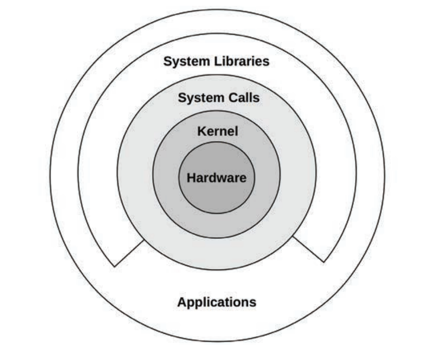
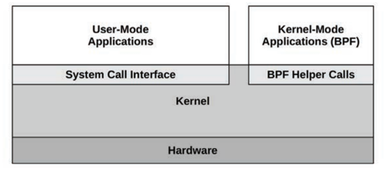

**Applications**: include all running user-level software, including databases, web servers, administration tools, and
operating system shells.

**System libraries**: used to provide a richer and easier programming interface than the system calls alone.
Applications can call system calls(syscalls) directly. For example, the Golang runtime has its own syscall layer that
doesn’t require the system library, libc.

**Extended BPF**: Linux has recently changed its model by allowing a new software type: Extended BPF, which enables
secure kernel-mode applications along with its own kernel API: BPF helpers. This allows some applications and system
functions to be rewritten in BPF, providing higher levels of security and performance.

**Kernel execution**: The kernel primarily executes on demand, when a user-level program makes a system call, or a
device sends an interrupt. Some kernel threads operate asynchronously for housekeeping, which may include the kernel
clock routine and memory management tasks, but these try to be lightweight and consume very little CPU resources.

### Kernel-Mode And User-Mode

**Kernel-Mode**: The kernel runs in a special CPU mode called kernel mode, allowing full access to devices and the
execution of privileged instructions.

**User-Mode**: User programs (processes) run in user mode, where they request privileged operations from the kernel via
system calls, such as for I/O.

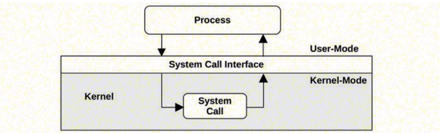

In a traditional kernel, a system call is performed by switching to kernel mode and then executing the system call code.

Switching between user and kernel modes is a **mode switch**.

All system calls mode switch. Some system calls also **context switch**: those that are blocking, such as for disk and
network I/O, will context switch so that another thread can run while the first is blocked.

Since mode and context switches cost a small amount of overhead (CPU cycles), there are various optimizations to avoid
them, including:

- **User-mode syscalls**: It is possible to implement some syscalls in a user-mode library alone. The Linux kernel does
  this by exporting a virtual dynamic shared object (vDSO) that is mapped into the process address space, which contains
  syscalls such as gettimeofday(2)
  and getcpu(2)
- **Memory mappings**:Used for demand paging, it can also be used for data stores and other I/O, avoiding syscall
  overheads.
- **Kernel bypass**: This allows user-mode programs to access devices directly, bypassing syscalls and the typical
  kernel code path. For example, DPDK for networking: the Data Plane Development Kit.
- **Kernel-mode applications**: the extended BPF technology

### System Call

System calls request the kernel to perform privileged system routines.

| Key System Call | Description |
| ----------- | ----------- |
| read(2)     | Read bytes |
| write(2)    | Write bytes |
| open(2)     | Open a file |
| close(2)    |  Close a file |
| fork(2)     | Create a new process |
| clone(2)    | Create a new process or thread |
| exec(2)     | Execute a new program |
| connect(2)  | Connect to a network host |
| accept(2)   | Accept a network connection |
| stat(2)     | Fetch file statistics |
| ioctl(2)    | Set I/O properties, or other miscellaneous functions |
| mmap(2)     | Map a file to the memory address space |
| brk(2)      | Extend the heap pointer |
| futex(2)    | Fast user-space mutex |

Operating systems generally include a C standard library that provides easier-to-use interfaces for many common
syscalls (e.g., the libc or glibc libraries). You can learn more in its man page.

Many of these system calls have an obvious purpose. Here are a few whose common usage may be less obvious:

- **ioctl(2)**: This is commonly used to request miscellaneous actions from the kernel, especially for system
  administration tools, where another (more obvious) system call isn’t suitable.
- **mmap(2)**: This is commonly used to map executables and libraries to the process address space, and for
  memory-mapped files. It is sometimes used to allocate the working memory of a process, instead of the brk(2)-based
  malloc(2), to reduce the syscall rate and improve performance (which doesn’t always work due to the trade-off
  involved: memory-mapping management).
- **brk(2)**: This is used to extend the heap pointer, which defines the size of the working memory of the process. It
  is typically performed by a system memory allocation library, when a malloc(3) (memory allocate) call cannot be
  satisfied from the existing space in the heap.
- **futex(2)**: This syscall is used to handle part of a user space lock: the part that is likely to block.

The ioctl(2) syscall may be the most difficult to learn, due to its ambiguous nature. As an example of its usage, the
Linux perf(1) tool performs privileged actions to coordinate performance instrumentation. Instead of system calls being
added for each action, a single system call is added: perf_event_open(2), which returns a file descriptor for use with
ioctl(2).This ioctl(2) can then be called using different arguments to perform the different desired actions. For
example, ioctl(fd, PERF_EVENT_IOC_ENABLE) enables instrumentation. The arguments, in this example PERF_EVENT_IOC_ENABLE,
can be more easily added and changed by the developer.

### Interrupts

An **interrupt** is a signal to the processor that some event has occurred that needs processing, and interrupts the
current execution of the processor to handle it. It typically causes the processor to enter kernel mode if it isn’t
already, save the current thread state, and then run an **interrupt service routine** (ISR) to process the event.

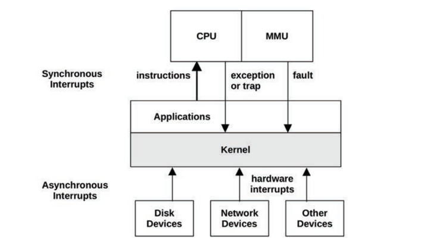

There are asynchronous interrupts generated by external hardware and synchronous interrupts generated by software
instructions.

**Asynchronous Interrupts**

Hardware devices can send **interrupt service requests** (IRQs) to the processor, which arrive asynchronously to the
currently running software. Examples of hardware interrupts include:

- Disk devices signaling the completion of disk I/O
- Hardware indicating a failure condition
- Network interfaces signaling the arrival of a packet
- Input devices: keyboard and mouse input

The completion interrupt has occurred asynchronously to the database, showed by a dotted line in Figure.
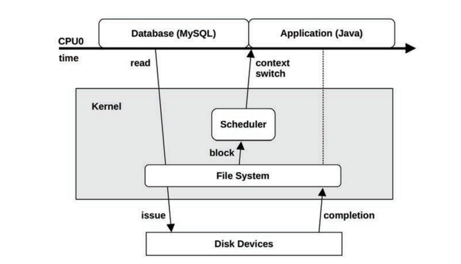

**Synchronous Interrupts**

Synchronous interrupts are generated by software instructions. The following describes different types of software
interrupts using the terms **traps**, **exceptions**, and **faults**; For these interrupts, the responsible software and
instruction are still on CPU. However, these terms are often used interchangeably.

- Traps: A deliberate call into the kernel, such as by the int (interrupt) instruction. One implementation of syscalls
  involves calling the int instruction with a vector for a syscall handler (e.g., int 0x80 on Linux x86). int raises a
  software interrupt.
- Exceptions: A exceptional condition, such as by an instruction performing a divide by zero.
- Faults: A term often used for memory events, such as page faults triggered by accessing a memory location without an
  MMU mapping.

**Interrupt Threads**

Interrupt service routines (ISRs) are designed to operate as quickly as possible, to reduce the effects of interrupting
active threads. If an interrupt needs to perform more than a little work, especially if it may block on locks, it can be
processed by an interrupt thread that can be scheduled by the kernel.

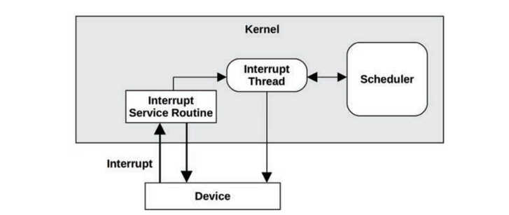

On Linux, device drivers can be modeled as two halves, with the top half handling the interrupt quickly, and scheduling
work to a bottom half to be processed later. Handling the interrupt quickly is important as the top half runs in
**interrupt-disabled mode** to postpone the delivery of new interrupts, which can cause latency problems for other
threads if it runs for too long. The bottom half can be either **tasklets** or **work queues**; the latter are threads
that can be scheduled by the kernel and can sleep when necessary.

Linux network drivers, for example, have a top half to handle IRQs for inbound packets, which calls the bottom half to
push the packet up the network stack. The bottom half is implemented as a **softirq** (software interrupt).

The time from an interrupt’s arrival to when it is serviced is the **interrupt latency**, which is dependent on the
hardware and implementation. This is a subject of study for real-time or low-latency systems.

**Interrupt Masking**

Some code paths in the kernel cannot be interrupted safely. The kernel can temporarily mask interrupts by setting the
CPU’s interrupt mask register. The interrupt disabled time should be as short as possible, as it can perturb the timely
execution of applications that are woken up by other interrupts.

Interrupt disabled time is also a target of performance analysis (such analysis is supported directly by the Ftrace
irqsoff tracer).

### Clock And Idle

The Linux clock routine is scheduler_tick(), and Linux has ways to omit calling the clock while there isn’t any CPU
load. The clock itself typically runs at 250 Hertz (configured by the CONFIG_HZ Kconfig option and variants), and its
calls are reduced by the NO_HZ functionality (configured by CONFIG_NO_HZ and variants), which is now commonly enabled.

**Idle Thread**

When there is no work for the CPUs to perform, the kernel schedules a placeholder thread that waits for work, called the
idle thread. A simple implementation would check for the availability of new work in a loop. In modern Linux the idle
task can call the hlt (halt) instruction to power down the CPU until the next interrupt is received, saving power.

### Processes

A **process** is an environment for executing a user-level program. It consists of a memory address space, file
descriptors, thread stacks, and registers.

**MultiTasks**

Processes are **multitasked** by the kernel, which typically supports the execution of thousands of processes on a
single system. They are individually identified by their process ID (PID), which is a unique numeric identifier.

A process contains one or more threads, which operate in the process address space and share the same file descriptors.
A **thread** is an executable context consisting of a stack, registers, and an instruction pointer (also called a
program counter). Multiple threads allow a single process to execute in **parallel** across multiple CPUs. On Linux,
threads and processes are both **task**s.

**init process**

The first process launched by the kernel is called “init,” from /sbin/init (by default), with PID 1, which launches user
space services. Linux distributions now commonly use the systemd software to start services and track their
dependencies.

**Process Creation**

Processes are normally created using the fork(2) system call on Unix systems. On Linux, C libraries typically implement
the fork function by wrapping around the versatile clone(2) syscall. These syscalls create a duplicate of the process,
with its own process ID. The exec(2) system call(or a variant, such as execve(2)) can then be called to begin execution
of a different program.

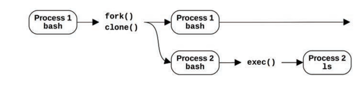

The fork(2) or clone(2) syscall may use a **copy-on-write** (COW) strategy to improve performance. This adds references
to the previous address space rather than copying all of the contents. Once either process modifies the
multiple-referenced memory, a separate copy is then made for the modifications. This strategy either defers or
eliminates the need to copy memory, reducing memory and CPU usage.

**Process Life Cycle**

For modern multithreaded operating systems, it is the threads that are scheduled and run, and there are some additional
implementation details regarding how these map to process states

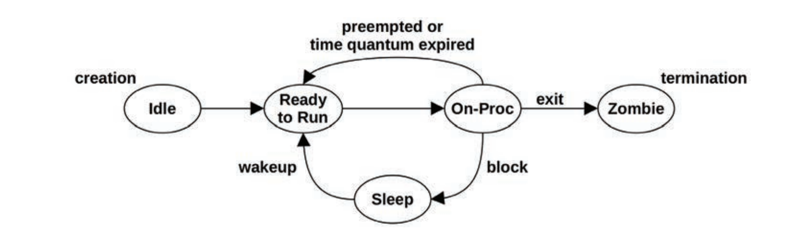

The on-proc state is for running on a processor (CPU). The ready-to-run state is when the process is runnable but is
waiting on a CPU run queue for its turn on a CPU. Most I/O will block, putting the process in the sleep state until the
I/O completes and the process is woken up. The zombie state occurs during process termination, when the process waits
until its process status has been reaped by the parent process or until it is removed by the kernel.

**Process Environment**

The process environment consists of data in the address space of the process and metadata (context) in the kernel.

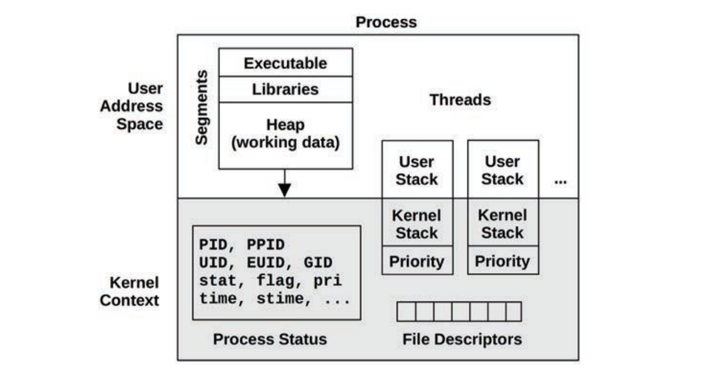

The kernel context consists of various process properties and statistics: its process ID (PID), the owner’s user ID (
UID), and various times. These are commonly examined via the ps(1) and top(1) commands. It also has a set of file
descriptors, which refer to open files and which are (usually) shared between threads.

The user address space contains memory segments of the process: executable, libraries, and heap.

On Linux, each thread has its own user stack and a kernel exception stack.

### Stacks

A stack is a memory storage area for temporary data, organized as a last-in, first-out (LIFO) list.

It is used to store less important data than that which fits in the CPU register set. When a function is called, the
return address is saved to the stack. Some registers may be saved to the stack as well if their values are needed after
the call. When the called function has finished, it restores any required registers and, by fetching the return address
from the stack, passes execution to the calling function. The stack can also be used for passing parameters to
functions. The set of data on a stack related to a function’s execution is called a **stack frame**.

**Stack Trace**

The call path to the currently executing function can be seen by examining the saved return addresses across all the
stack frames in the thread’s stack (a process called **stack walking**).

This call path is referred to as a **stack back trace** or a **stack trace**. In performance engineering it is often
called just a “stack” for short. These stacks can answer why something is executing, and are an invaluable tool for
debugging and performance analysis.

**How to Read a Stack**

Stacks are usually printed in leaf-to-root order, so the first line printed is the function currently executing, and
beneath it is its parent, then its grandparent, and so on.

By reading down the stack, the full ancestry can be seen: function, parent, grandparent, and so on. Or, by reading
bottom-up, you can follow the path of execution to the current function: how we got here.

Since stacks expose the internal path taken through source code, there is typically no documentation for these functions
other than the code itself.

**User and Kernel Stacks**

While executing a system call, a process thread has two stacks: a user-level stack and a kernel-level stack.

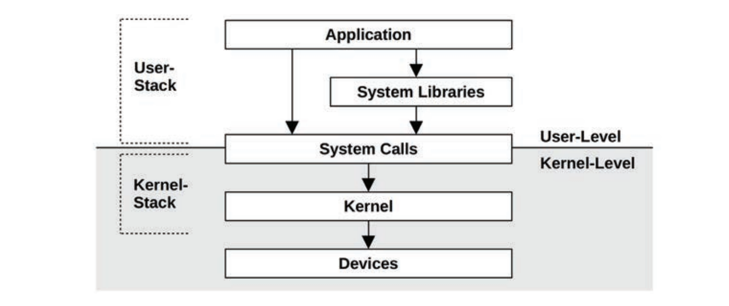

The user-level stack of the blocked thread does not change for the duration of a system call, as the thread is using a
separate kernel-level stack while executing in kernel context.

On Linux, there are multiple kernel stacks for different purposes. Syscalls use a kernel exception stack associated with
each thread, and there are also stacks associated with soft and hard interrupts 。

### Virtual Memory

Virtual memory is an abstraction of main memory, providing processes and the kernel with their own, almost infinite,
private view of main memory.

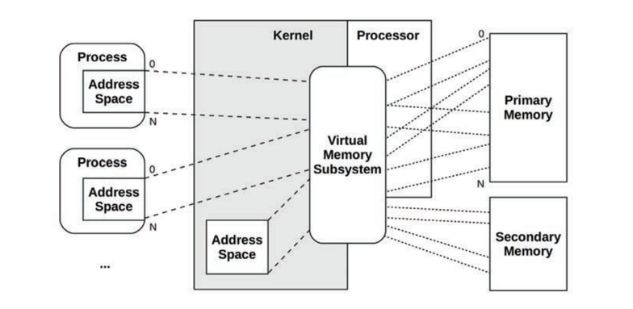

Virtual memory supports multitasking, allowing processes and the kernel to operate on their own private address spaces
without worrying about contention. It also supports oversubscription of main memory, allowing the operating system to
transparently map virtual memory between main memory and secondary storage (disks) as needed.

**Memory Management**

While virtual memory allows main memory to be extended using secondary storage.

In Linux, the term swapping is used to refer to paging. The Linux kernel does not support the(older) Unix-style process
swapping of entire threads and processes.

### Schedulers

The scheduling of processes on processors and individual CPUs is performed by the **scheduler**, a key component of the
operating system kernel. The scheduler operates on threads (in Linux, tasks), mapping them to CPUs.

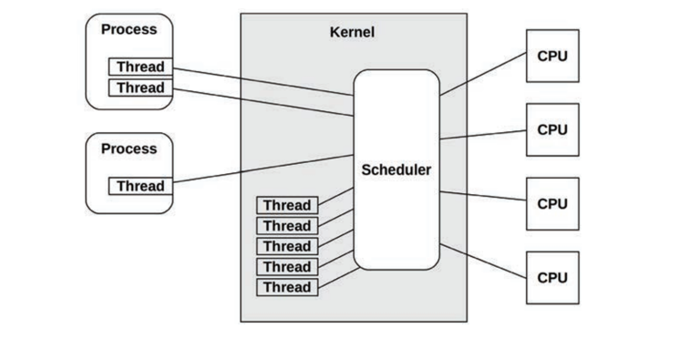

The basic intent is to divide CPU time among the active processes and threads, and to maintain a notion of **priority**
so that more important work can execute sooner. The scheduler keeps track of all threads in the ready-to-run state,
traditionally on per-priority queues called **run queues**. Modern kernels may implement these queues per CPU and may
also use other data structures, apart from queues, to track the threads. When more threads want to run than there are
available CPUs, the lower-priority threads wait their turn. Most kernel threads run with a higher priority than
user-level processes.

Process priority can be modified dynamically by the scheduler to improve the performance of certain workloads. Workloads
can be categorized as either:

- **CPU-bound**: Applications that perform heavy compute, for example, scientific and mathematical analysis, which are
  expected to have long runtimes (seconds, minutes, hours, days, or even longer). These become limited by CPU resources.
- **I/O-bound**: Applications that perform I/O, with little compute, for example, web servers, file servers, and
  interactive shells, where low-latency responses are desirable. When their load increases, they are limited by I/O to
  storage or network resources.

A commonly used scheduling policy dating back to UNIX identifies CPU-bound workloads and decreases their priority,
allowing I/O-bound workloads—where low-latency responses are more desirable—to run sooner. This can be achieved by
calculating the ratio of recent compute time(time executing on-CPU) to real time (elapsed time) and decreasing the
priority of processes with a high (compute)ratio. This mechanism gives preference to shorter-running processes, which
are usually those performing I/O, including human interactive processes.

Modern kernels support multiple **scheduling classes** or **scheduling policies** (Linux) that apply different
algorithms for managing priority and runnable threads. These may include real-time scheduling, which uses a priority
higher than all noncritical work, including kernel threads. Along with preemption support, real-time scheduling provides
predictable and low-latency scheduling for systems that require it.

### File Systems

File systems are an organization of data as files and directories. They have a file-based interface for accessing them,
usually based on the POSIX standard. Kernels support multiple file system types and instances.

The operating system provides a global file namespace, organized as a top-down tree topology starting with the root
level (“/”). File systems join the tree by **mounting**, attaching their own tree to a directory (**the mount point**).
This allows the end user to navigate the file namespace transparently, regardless of the underlying file system type.

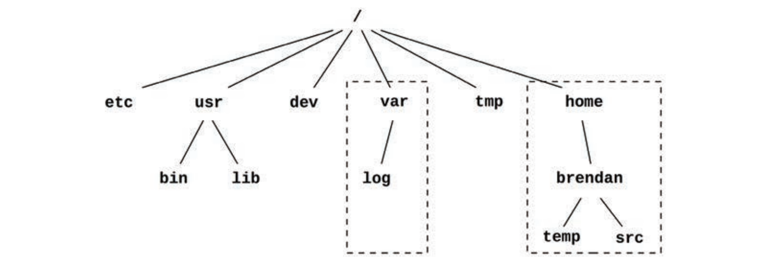

The top-level directories include:

- etc for system configuration files,
- usr for system-supplied user-level programs and libraries,
- dev for device nodes,
- var for varying files including system logs,
- tmp for temporary files,
- home for user home directories.

In the example pictured, var and home may reside on their own file system instances and separate storage devices;
however, they can be accessed like any other component of the tree.

Most file system types use storage devices (disks) to store their contents. Some file system types are dynamically
created by the kernel, such as **/proc** and **/dev**.

Kernels typically provide different ways to isolate processes to a portion of the file namespace, including **chroot(
8)**, and, on Linux, **mount namespaces**, commonly used for containers.

**VFS**

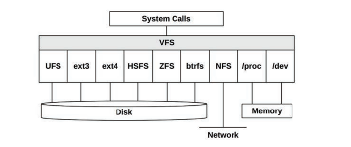

The virtual file system (VFS) is a kernel interface to abstract file system types, so that the Unix file system (UFS)
and the Network file system (NFS) could more easily coexist.

**I/O Stack**

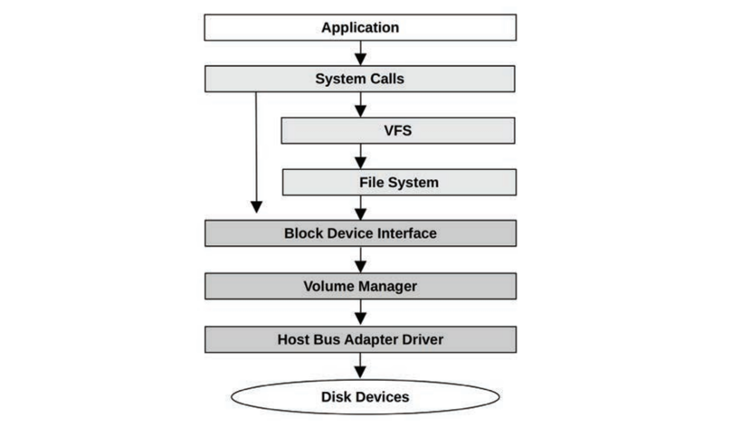

For storage-device-based file systems, the path from user-level software to the storage device is called the **I/O
stack**. This is a subset of the entire software stack shown earlier.

### Caches

Since disk I/O has historically had high latency, many layers of the software stack attempt to avoid it by caching reads
and buffering writes.

The types of caches present will vary based on the system and environment. Example cache layers for disk I/O:

| Cache  | Examples |
| ------ | -------- |
| Client cache | Web browser cache |
| Application cache | --- |
| Web server cache | Apache cache |
| Caching server | memcached |
| Database cache | MySQL buffer cache |
| Directory cache | dcache |
| File metadata cache | inode cache |
| Operating system buffer cache |  Buffer cache |
| File system primary cache | Page cache, ZFS ARC |
| File system secondary cache |  ZFS L2ARC |
| Device cache | ZFS vdev |
| Block cache | Buffer cache |
| Disk controller cache | RAID card cache |
| Storage array cache | --- |
| On-disk cache | --- |

For example, the buffer cache is an area of main memory that stores recently used disk blocks. Disk reads may be served
immediately from the cache if the requested block is present, avoiding the high latency of disk I/O.

### Networks

[SNMP](https://www.kernel.org/doc/html/v5.0/networking/snmp_counter.html)

Modern kernels provide a stack of built-in network protocols, allowing the system to communicate via the network and
take part in distributed system environments. This is referred to as the **networking stack** or the **TCP/IP stack**,
after the commonly used TCP and IP protocols. User-level applications access the network through programmable endpoints
called **sockets**.

The physical device that connects to the network is the **network interface** and is usually provided on a **network
interface card** (NIC). A historical duty of the system administrator was to associate an **IP address** with a network
interface, so that it can communicate with the network; these mappings are now typically automated via the dynamic host
configuration protocol (**DHCP**).

Network protocols do not change often. Protocol enhancements and options change more often, such as newer TCP options
and TCP congestion control algorithms. Newer protocols and enhancements typically require kernel support (with the
exception of user-space protocol implementations). Another change is support for different network interface cards,
which require new device drivers for the kernel.

### Device

A kernel must communicate with a wide variety of physical devices. Such communication is achieved using device drivers:
kernel software for device management and I/O. Device drivers are often provided by the vendors who develop the hardware
devices. Some kernels support **pluggable device drivers**, which can be loaded and unloaded without requiring a system
restart.

Device drivers can provide character and/or block interfaces to their devices. **Character devices**, also called **raw
devices**, provide unbuffered sequential access of any I/O size down to a single character, depending on the device.
Such devices include keyboards and serial ports (and in original Unix, paper tape and line printer devices).

**Block devices** perform I/O in units of blocks, which have historically been 512 bytes each. These can be accessed
randomly based on their block offset, which begins at 0 at the start of the block device. In original Unix, the block
device interface also provided caching of block device buffers to improve performance, in an area of main memory called
the buffer cache. In Linux, this buffer cache is now part of the page cache.

### Multiprocessor

Multiprocessor support allows the operating system to use multiple CPU instances to execute work in parallel. It is
usually implemented as symmetric multiprocessing (**SMP**) where all CPUs are treated equally.

This was technically difficult to accomplish, posing problems for accessing and sharing memory and CPUs among threads
running in parallel.

On multiprocessor systems there may also be banks of main memory connected to different sockets (physical processors) in
a non-uniform memory access (NUMA) architecture, which also pose performance challenges.

**IPI**

For a multiprocessor system, there are times when CPUs need to coordinate, such as for cache coherency of memory
translation entries (informing other CPUs that an entry, if cached, is now stale). A CPU can request other CPUs, or all
CPUs, to immediately perform such work using an **inter-processor interrupt** (IPI) (also known as an SMP call or a CPU
cross call). IPIs are processor interrupts designed to be executed quickly, to minimize interruption of other threads.

IPIs can also be used by preemption.

### Preemption

Kernel preemption support allows high-priority user-level threads to interrupt the kernel and execute.

Approach supported by Linux is **voluntary kernel preemption**, where logical stopping points in the kernel code can
check and perform preemption. This avoids some of the complexity of supporting a fully preemptive kernel and provides
low-latency preemption for common workloads. Voluntary kernel preemption is commonly enabled in Linux via the
CONFIG_PREEMPT_VOLUNTARY Kconfig option; there is also CONFIG_PREEMPT to allow all kernel code (except critical
sections) to be preemptible, and CONFIG_PREEMPT_NONE to disable preemption, improving throughput at the cost of higher
latencies.

### Resource Management

The operating system may provide various configurable controls for fine-tuning access to system resources, such as CPUs,
memory, disk, and the network.

These are resource controls and can be used to manage performance on systems that run different applications or host
multiple tenants(cloud computing). Such controls may impose fixed limits per process (or groups of processes) for
resource usage, or a more flexible approach—allowing spare usage to be shared among them.

Early versions of Unix and BSD had basic per-process resource controls, including CPU priorities with nice(1), and some
resource limits with ulimit(1).

For Linux, control groups (cgroups) have been developed and integrated in Linux 2.6.24 (2008), and various additional
controls have been added since then. These are documented in the kernel source under Documentation/cgroups. There is
also an improved unified hierarchical scheme called cgroup v2, made available in Linux 4.5 (2016) and documented in
Documentation/adminguide/cgroup-v2.rst.

# Linux Kernel Developments

Linux kernel developments, especially those related to performance, include the following
(many of these descriptions include the Linux kernel version where they were first introduced):

| Feature      | Description |
| ------------ | ----------- |
| CPU scheduling classes | Various advanced CPU scheduling algorithms have been developed, including scheduling domains (2.6.7) to make better decisions regarding nonuniform memory access (NUMA).|
| I/O scheduling classes | Different block I/O scheduling algorithms have been developed,including deadline (2.5.39), anticipatory (2.5.75), and completely fair queueing (CFQ)(2.6.6). These are available in kernels up to Linux 5.0, which removed them to support only newer multi-queue I/O schedulers. |
| TCP congestion algorithms | Linux allows different TCP congestion control algorithms to be configured, and supports Reno, Cubic, and more.  |
| Overcommit             | Along with the out-of-memory (OOM) killer, this is a strategy for doing more with less main memory. |
| Futex (2.5.7) | Short for fast user-space mutex, this is used to provide high-performing user-level synchronization primitives. |
| Huge pages (2.5.36) | This provides support for preallocated large memory pages by the kernel and the memory management unit (MMU). |
| OProfile (2.5.43) | A system profiler for studying CPU usage and other events, for both the kernel and applications. |
| RCU (2.5.43) | The kernel provides a read-copy update synchronization mechanism that allows multiple reads to occur concurrently with updates, improving performance and scalability for data that is mostly read. |
| epoll (2.5.46)  | A system call for efficiently waiting for I/O across many open file descriptors, which improves the performance of server applications. |
| Modular I/O scheduling (2.6.10) | Linux provides pluggable scheduling algorithms for scheduling block device I/O. |
| DebugFS (2.6.11) | A simple unstructured interface for the kernel to expose data to user level, which is used by some performance tools. |
| Cpusets (2.6.12) | exclusive CPU grouping for processes. |
| Voluntary kernel preemption (2.6.13) | This process provides low-latency scheduling without the complexity of full preemption. |
| inotify (2.6.13) | A framework for monitoring file system events. |
| blktrace (2.6.17) | A framework and tool for tracing block I/O events (later migrated into tracepoints). |
| splice (2.6.17) | A system call to move data quickly between file descriptors and pipes, without a trip through user-space. (The sendfile(2) syscall, which efficiently moves data between file descriptors, is now a wrapper to splice(2).) |
| Delay accounting (2.6.18) | Tracks per-task delay states. |
| IO accounting (2.6.20) | Measures various storage I/O statistics per process. |
| DynTicks (2.6.21) | Dynamic ticks allow the kernel timer interrupt (clock) to not fire during idle, saving CPU resources and power. |
| SLUB (2.6.22) | A new and simplified version of the slab memory allocator. |
| CFS (2.6.23) | Completely fair scheduler. |
| cgroups (2.6.24) | Control groups allow resource usage to be measured and limited for groups of processes. |
| TCP LRO (2.6.24) | TCP Large Receive Offload (LRO) allows network drivers and hardware to aggregate packets into larger sizes before sending them to the network stack. Linux also supports Large Send Offload (LSO) for the send path. |
| latencytop (2.6.25) | Instrumentation and a tool for observing sources of latency in the operating system. |
| Tracepoints (2.6.28) | Static kernel tracepoints (aka static probes) that instrument logical execution points in the kernel, for use by tracing tools (previously called kernel markers). |
| perf (2.6.31) | Linux Performance Events (perf) is a set of tools for performance observability, including CPU performance counter profiling and static and dynamic tracing. |
| No BKL (2.6.37) | Final removal of the big kernel lock (BKL) performance bottleneck. |
| Transparent huge pages (2.6.38) | This is a framework to allow easy use of huge (large) memory pages. |
| KVM | The Kernel-based Virtual Machine (KVM) technology was developed for Linux by Qumranet, which was purchased by Red Hat in 2008. KVM allows virtual operating system instances to be created, running their own kernel. |
| BPF JIT (3.0) | A Just-In-Time (JIT) compiler for the Berkeley Packet Filter (BPF) to improve packet filtering performance by compiling BPF bytecode to native instructions. |
| CFS bandwidth control (3.2) | A CPU scheduling algorithm that supports CPU quotas and throttling. |
| TCP anti-bufferbloat (3.3+) | Various enhancements were made from Linux 3.3 onwards to combat the bufferbloat problem, including Byte Queue Limits (BQL) for the transmission of packet data (3.3), CoDel queue management (3.5), TCP small queues (3.6), and the Proportional Integral controller Enhanced (PIE) packet scheduler (3.14). |
| uprobes (3.5) | The infrastructure for dynamic tracing of user-level software, used by other tools (perf, SystemTap, etc.). |
| TCP early retransmit (3.5) | RFC 5827 for reducing duplicate acknowledgments required to trigger fast retransmit. |
| TFO (3.6, 3.7, 3.13) |  TCP Fast Open (TFO) can reduce the TCP three-way handshake to a single SYN packet with a TFO cookie, improving performance. It was made the default in 3.13. |
| NUMA balancing (3.8+) | This added ways for the kernel to automatically balance memory locations on multi-NUMA systems, reducing CPU interconnect traffic and improving  performance.|
| SO_REUSEPORT (3.9) | A socket option to allow multiple listener sockets to bind to the same port, improving multi-threaded scalability. |
| SSD cache devices (3.9) |  Device mapper support for an SSD device to be used as a cache for a slower rotating disk. |
| bcache (3.10) |  An SSD cache technology for the block interface. | 
| TCP TLP (3.10)  |  TCP Tail Loss Probe (TLP) is a scheme to avoid costly timer-based retransmits by sending new data or the last unacknowledged segment after a shorter probe timeout, to  trigger faster recovery. |
| NO_HZ_FULL (3.10, 3.12) |  Also known as timerless multitasking or a tickless kernel, this allows non-idle threads to run without clock ticks, avoiding workload perturbations. |
| Multiqueue block I/O (3.13) |  This provides per-CPU I/O submission queues rather than a single request queue, improving scalability especially for high IOPS SSD devices. |
| SCHED_DEADLINE (3.14) |  An optional scheduling policy that implements earliest deadline first (EDF)scheduling. |  
| TCP autocorking (3.14) |  This allows the kernel to coalesce small writes, reducing the sent packets. An automatic version of the TCP_CORK setsockopt(2). |
| MCS locks and qspinlocks (3.15) |  Efficient kernel locks, using techniques such as perCPU structures. MCS is named after the original lock inventors (Mellor-Crummey and Scott). |
| Extended BPF (3.18+) | An in-kernel execution environment for running secure kernel-mode programs. The bulk of extended BPF was added in the 4.x series. Support for attached to kprobes was added in 3.19, to tracepoints in 4.7, to software and hardware events in 4.9, and to cgroups in 4.10. Bounded loops were added in 5.3, which also increased the instruction limit to allow complex applications. |
| Overlayfs (3.18) | A union mount file system included in Linux. It creates virtual file systems on top of others, which can also be modified without changing the first. Often used for containers.|
| DCTCP (3.18) |  The Data Center TCP (DCTCP) congestion control algorithm, which aims to provide high burst tolerance, low latency, and high throughput. |
| DAX (4.0) |  Direct Access (DAX) allows user space to read from persistent-memory storage devices directly, without buffer overheads. ext4 can use DAX. |
| Queued spinlocks (4.2) | Offering better performance under contention, these became the default spinlock kernel implementation in 4.2. |
| TCP lockless listener (4.4) |  The TCP listener fast path became lockless, improving performance. |
| cgroup v2 (4.5, 4.15)  |  A unified hierarchy for cgroups was in earlier kernels, and considered stable and exposed in 4.5, named cgroup v2. The cgroup v2 CPU controller was added in 4.15. |
| epoll scalability (4.5) | For multithreaded scalability, epoll(7) avoids waking up all threads that are waiting on the same file descriptors for each event, which caused a thunderingherd performance issue. | 
| KCM (4.6) |  The Kernel Connection Multiplexor (KCM) provides an efficient messagebased interface over TCP. |
| TCP NV (4.8) |  New Vegas (NV) is a new TCP congestion control algorithm suited for high-bandwidth networks (those that run at 10+ Gbps) |
| XDP (4.8, 4.18) |  eXpress Data Path (XDP) is a BPF-based programmable fast path for high-performance networking. An AF_XDP socket address family that can bypass much of the network stack was added in 4.18. |
| TCP BBR (4.9) |  Bottleneck Bandwidth and RTT (BBR) is a TCP congestion control algorithm that provides improved latency and throughput over networks suffering packet loss and bufferbloat. |
| Hardware latency tracer (4.9) |  An Ftrace tracer that can detect system latency caused by hardware and firmware, including system management interrupts (SMIs). |
| perf c2c (4.10) |  The cache-to-cache (c2c) perf subcommand can help identify CPU cache performance issues, including false sharing. |
| Intel CAT (4.10) |  Support for Intel Cache Allocation Technology (CAT) allowing tasks to have dedicated CPU cache space. This can be used by containers to help with the noisy neighbor problem. |
| Multiqueue I/O schedulers |  BPQ, Kyber (4.12): The Budget Fair Queueing (BFQ) multiqueue I/O scheduler provides low latency I/O for interactive applications, especially for slower storage devices. BFQ was significantly improved in 5.2. The Kyber I/O scheduler is suited for fast multiqueue devices. |
| Kernel TLS (4.13, 4.17) |  Linux version of kernel TLS. | 
| MSG_ZEROCOPY (4.14) |  A send(2) flag to avoid extra copies of packet bytes between an application and the network interface. |
| PCID (4.14) |  Linux added support for process-context ID (PCID), a processor MMU feature to help avoid TLB flushes on context switches. This reduced the performance cost of the kernel page table isolation (KPTI) patches needed to mitigate the meltdown vulnerability. |
| PSI (4.20, 5.2) |  Pressure stall information (PSI) is a set of new metrics to show time spent stalled on CPU, memory, or I/O. PSI threshold notifications were added in 5.2 to support PSI monitoring. |
| TCP EDT (4.20) | The TCP stack switched to Early Departure Time (EDT): This uses a timing-wheel scheduler for sending packets, providing better CPU efficiency and smaller queues . |
| Multi-queue I/O (5.0) |  Multi-queue block I/O schedulers became the default in 5.0, and classic schedulers were removed. | 
| UDP GRO (5.0) |  UDP Generic Receive Offload (GRO) improves performance by allowing packets to be aggregated by the driver and card and passed up stack. |
| io_uring (5.1) |  A generic asynchronous interface for fast communication between applications and the kernel, making use of shared ring buffers. Primary uses include fast disk and network I/O. | 
| MADV_COLD, MADV_PAGEOUT (5.4) | These madvise(2) flags are hints to the kernel that memory is needed but not anytime soon. MADV_PAGEOUT is also a hint that memory can be reclaimed immediately. These are especially useful for memory-constrained embedded Linux devices. |
| MultiPath TCP (5.6) | Multiple network links (e.g., 3G and WiFi) can be used to improve the performance and reliability of a single TCP connection. | 
| Boot-time tracing (5.6) | Allows Ftrace to trace the early boot process. (systemd can provide timing information on the late boot process) |
|  Thermal pressure (5.7)  |  The scheduler accounts for thermal throttling to make better placement decisions. | 
|  perf flame graphs (5.8)  |  perf(1) support for the flame graph visualization.  | 

# OS

[Operating System](OS.md)

[back up linux source](#linux-source)

