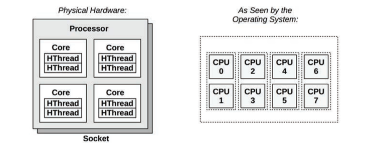
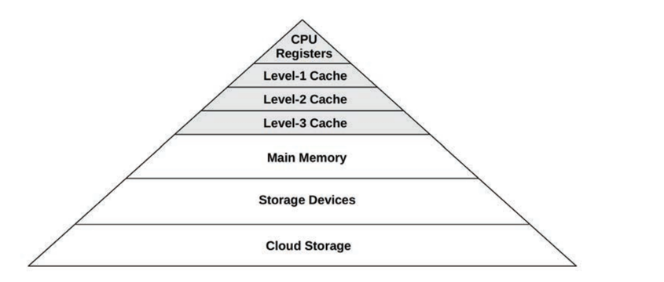

# README

Terminologies And Concepts About Linux CPU

# 目录

- [CPU相关的术语](./os_linux_cpu.md#cpu-related-terminology)
- [CPU模型](./os_linux_cpu.md#cpu-models)
    - [CPU架构](./os_linux_cpu.md#models-cpu-architecture)
    - [CPU缓存](./os_linux_cpu.md#models-cpu-memory-caches)
    - [CPU运行队列](./os_linux_cpu.md#models-cpu-run-queues)
- [CPU架构](./os_linux_cpu.md#cpu-architecture)
    - [CPU硬件架构](./os_linux_cpu.md#arch-cpu-hardware)
    - [CPU软件架构](./os_linux_cpu.md#arch-cpu-software)

## Questions

- Questions
    - What is the difference between a process and a processor?
    - What is a hardware thread?
    - What is the run queue?
    - What is the difference between user time and kernel time?
    - Describe CPU utilization and saturation.
    - Describe how the instruction pipeline improves CPU throughput.
    - Describe how processor instruction width improves CPU throughput.
    - Describe the advantages of multiprocess and multithreaded models
    - Describe what happens when the system CPUs are overloaded with runnable work, including the effect on application
      performance.
    - When there is no runnable work to perform, what do the CPUs do?
    - When handed a suspected CPU performance issue, name two methodologies you would use early during the
      investigation, and explain why.
    - A USE method checklist for CPU resources. Include how to fetch each metric (e.g., which command to execute) and
      how to interpret the result. Try to use existing OS observability tools before installing or using additional
      software products.
    - A workload characterization checklist for CPU resources. Include how to fetch each metric, and try to use existing
      OS observability tools first.
    - Calculate the load average for the following system, whose load is at steady state with no significant disk/lock
      load:
        - The system has 64 CPUs.
        - The system-wide CPU utilization is 50%.
        - The system-wide CPU saturation, measured as the total number of runnable and queued threads on average, is
          2.0.
    - Choose an application, and profile its user-level CPU usage. Show which code paths are consuming the most CPU.
    - Develop bustop(1)—a tool that shows physical bus or interconnect utilization—with a presentation similar to
      iostat(1):
      a list of buses, columns for throughput in each direction, and utilization. Include saturation and error metrics
      if possible. This will require using PMCs.

# Linux CPU

## CPU-Related Terminology

|   terminology    | desc  |
| ---------------- | ----- |
| Processor | The physical chip that plugs into a socket on the system or processor board and contains one or more CPUs implemented as cores or hardware threads. |
| Core      | An independent CPU instance on a multicore processor. The use of cores is a way to scale processors, called chip-level multiprocessing (CMP). |
| Hardware thread | A CPU architecture that supports executing multiple threads in parallel on a single core (including Intel’s Hyper-Threading Technology), where each thread is an independent CPU instance. This scaling approach is called simultaneous multithreading(SMT). |
| CPU instruction | A single CPU operation, from its instruction set. There are instructions for arithmetic operations, memory I/O, and control logic. |
| Logical CPU     | Also called a virtual processor, an operating system CPU instance (a schedulable CPU entity). This may be implemented by the processor as a hardware thread (in which case it may also be called a virtual core), a core, or a single-core processor. |
| Scheduler       | The kernel subsystem that assigns threads to run on CPUs. |
| Run queue       | A queue of runnable threads that are waiting to be serviced by CPUs. Modern kernels may use some other data structure (e.g., a red-black tree) to store runnable threads, but we still often use the term run queue. |

## CPU Models

### Models: CPU Architecture

Figure shows an example of CPU architecture, for a single processor with four cores and eight hardware threads in total.

Each `hardware thread` is addressable as a `logical CPU`, so this processor appears as eight CPUs. The operating system
may have some additional knowledge of topology to improve its scheduling decisions, such as which CPUs are on the same
core and how CPU caches are shared.

### Models: CPU Memory Caches

Processors provide various hardware caches for improving memory I/O performance. Figure shows the relationship of cache
sizes, which become smaller and faster (a trade-off) the closer they are to the CPU.

### Models: CPU Run Queues

Figure shows a CPU run queue, which is managed by the kernel scheduler.

The number of software threads that are queued and ready to run is an important performance metric indicating CPU
saturation.

The time spent waiting on a CPU run queue is sometimes called `run-queue latency` or `dispatcher-queue latency`.

For multiprocessor systems, the kernel typically provides a run queue for each CPU, and aims to keep threads on the same
run queue. This means that threads are more likely to keep running on the same CPUs where the CPU caches have cached
their data. These caches are described as having `cache warmth`, and this strategy to keep threads running on the same
CPUs is called `CPU affinity`. On NUMA systems, per-CPU run queues also improve memory locality. This improves
performance by keeping threads running on the same memory node, and avoids the cost of thread synchronization (mutex
locks) for queue operations, which would hurt scalability if the run queue was global and shared among all CPUs.

## CPU Architecture

### Arch: CPU Hardware

### Arch: CPU Software

